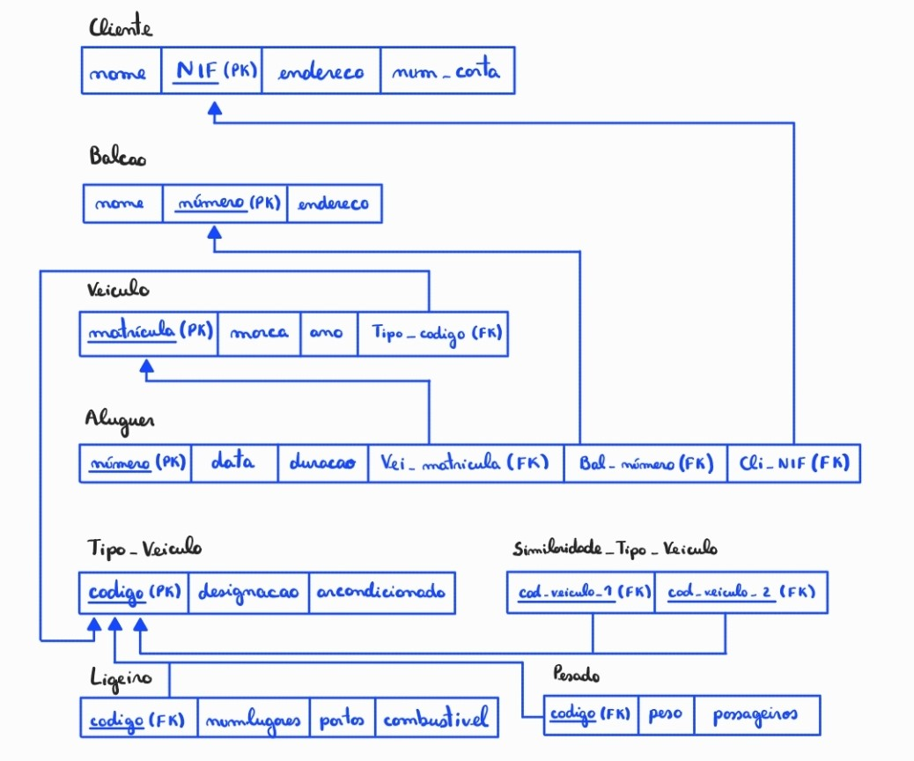
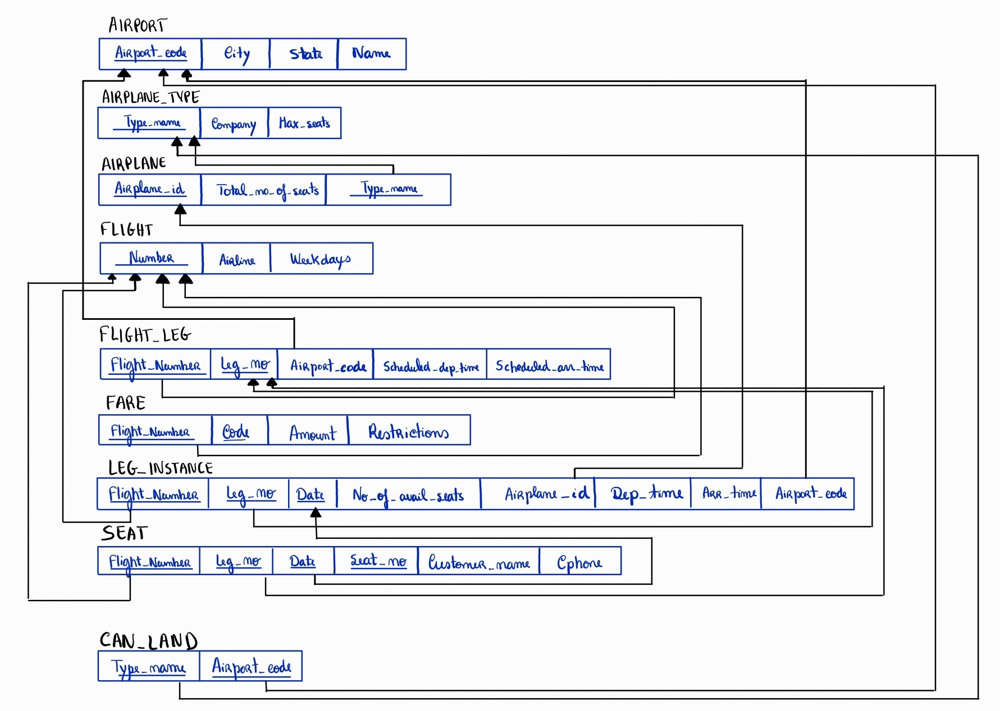
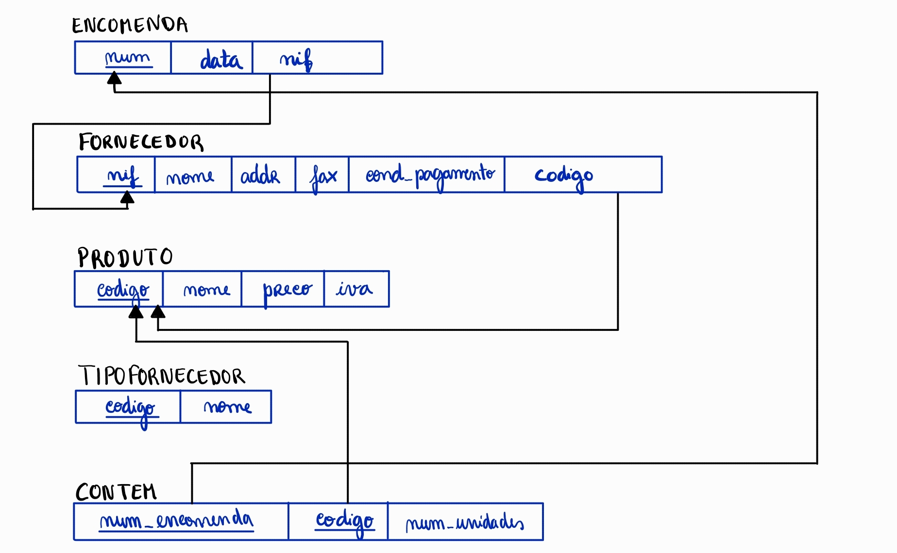
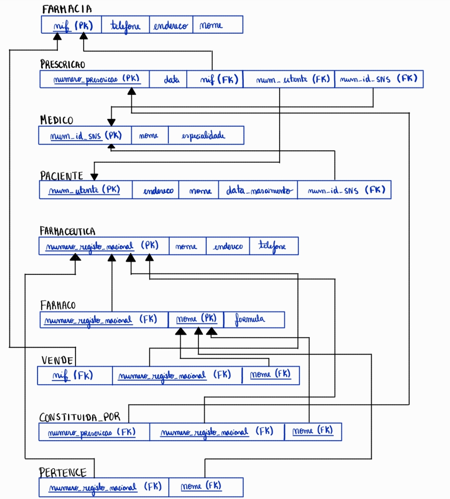
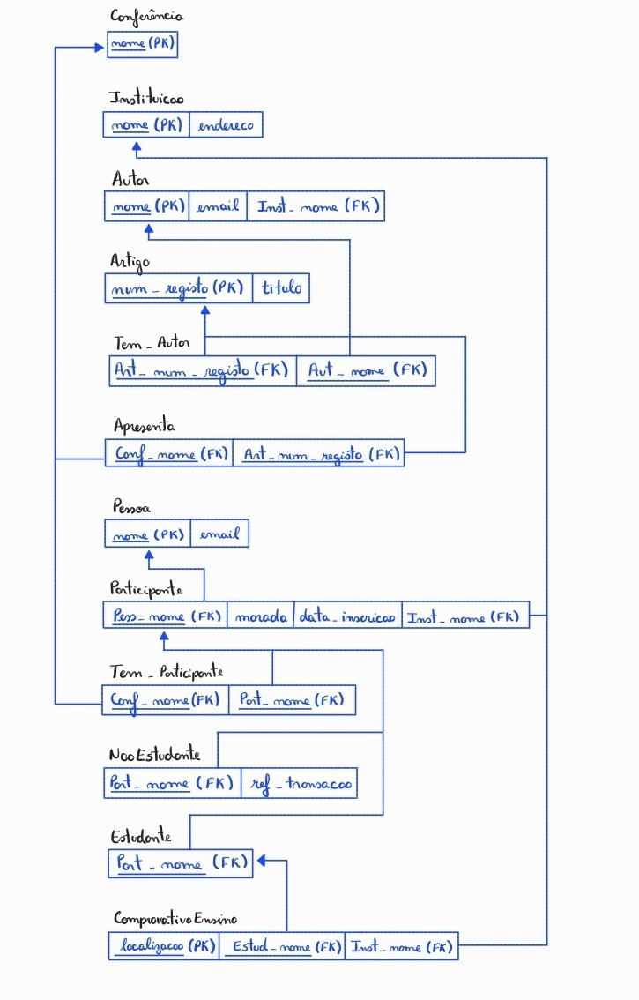
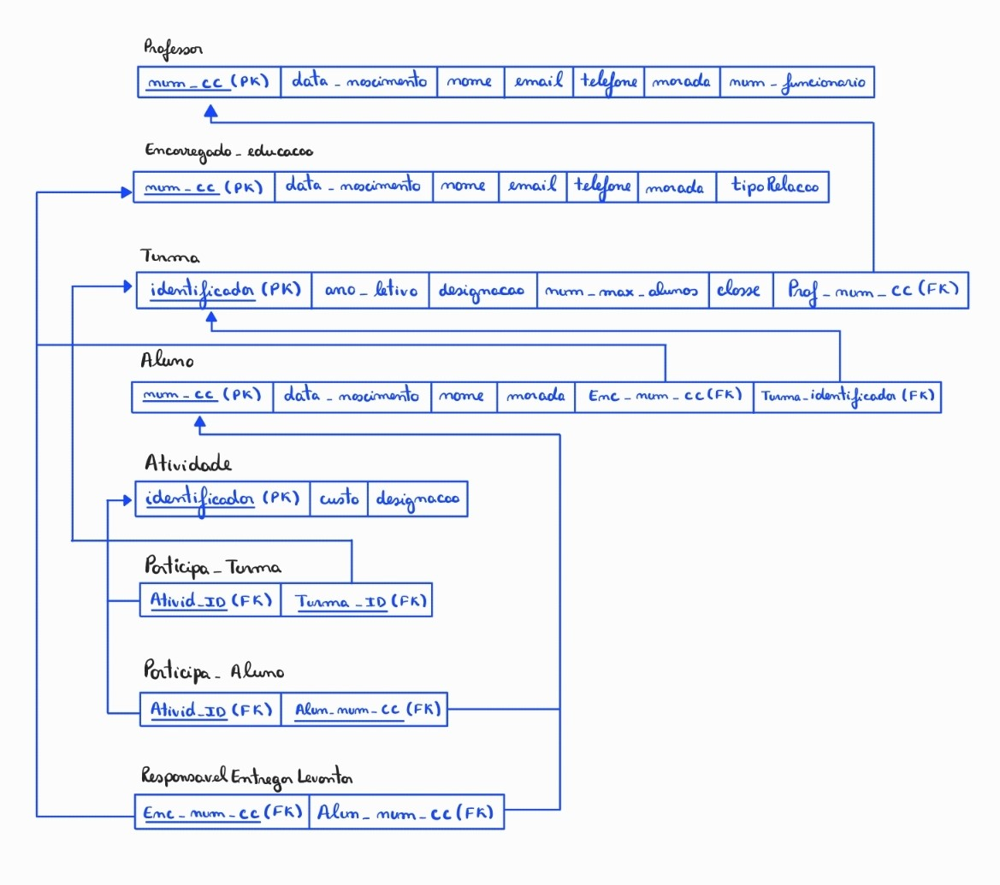

# BD: Guião 3


## ​Problema 3.1
 
### *a)*

```
Aluguer (numero (PK), data, duracao, Cli_NIF (FK), Bal_numero (FK), Vei_matricula (FK))
Cliente (nome, NIF (PK), endereco, num_carta)
Balcao (nome, numero (PK), enderco)
Veiculo (matricula (PK), marca, ano, Tipo_codigo (FK))
Tipo_Veiculo (codigo (Pk), designacao, arcondicionado)
Similaridade_Tipo_Veiculo (cod_veiculo_1 (FK), cod_veiculo_2 (FK))
Ligeiro (numlugares, portas, combustivel, codigo (FK))
Pesado (peso, passgeiros, codigo (FK))

```


### *b)* 

```
Chaves candidadatas:
    Aluguer ->
    Cliente ->
    Balcao ->
    Veiculo ->
    Tipo_Veiculo ->
    Similaridade_Tipo_Veiculo ->
    Ligeiro ->
    Pesado ->
Chaves primarias:
    Aluguer ->
    Cliente ->
    Balcao ->
    Veiculo ->
    Tipo_Veiculo ->
    Similaridade_Tipo_Veiculo ->
    Ligeiro ->
    Pesado ->
Chaves estrangueiras:
    Aluguer ->
    Cliente ->
    Balcao ->
    Veiculo ->
    Tipo_Veiculo ->
    Similaridade_Tipo_Veiculo ->
    Ligeiro ->
    Pesado ->

```


### *c)* 




## ​Problema 3.2

### *a)*

```
... Write here your answer ...
```


### *b)* 

```
... Write here your answer ...
```


### *c)* 




## ​Problema 3.3


### *a)* 2.1



### *b)* 2.2



### *c)* 2.3



### *d)* 2.4

